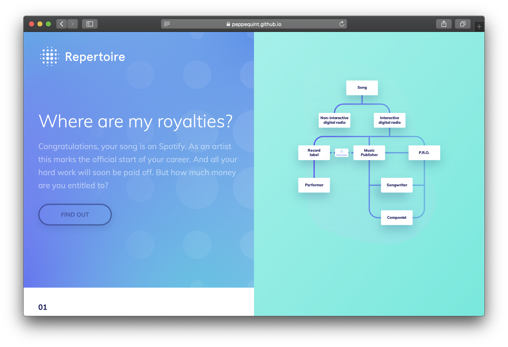

<p align="center">
	
</p>
<p align="center">
	
	<h5 align="center">INTRO</h5>
	<p align="center">
	Repertoire wants to solve some of problems by addressing the
	entire flow from musical work, sound recordings, licensing and
	rights associated with payment flows. We made a storytelling webpage to explain what <a href="https://www.repertoire.network/">Repertoire</a> wants to achieve.
	</p>
</p>
<br>

## Table of contents

- [Install](#install)
- [Features](#features)
- [Status](#status)
- [Sources](#sources)
- [Created by](#created-by)
- [License](#license)

## Setup

### Install

You have to need [Node.js](https://nodejs.org/en/download/) installed on your computer to run this project. To install this project on your computer, please follow the steps below from your command line:

```shell
# Clone repository
git clone https://github.com/peppequint/information-design.git

# Go to the repository
cd information-design

# Install dependencies
npm install

# Run & build
npm start
```

### Server

The website can only be properly tested at a local server. Therefore the server has to be started up.

```shell
# Run http-server
npm run server
```

```shell
Starting up http-server, serving /docs
Available on:
  http://127.0.0.1:8080
  http://145.28.224.70:8080
Hit CTRL-C to stop the server
```

Visit one of the link shown in the command line or go to  [localhost](localhost:8080).

## Features

### D3
The first feature added to the web page is [D3](https://github.com/d3/d3). With D3 it is easy to create an overview of all the different stakeholders. Also it is easy to change or add stakeholders to the data. Go to [index.js](index.js) to see the structure of the data which can be assembled. The code below creates different articles (nodes) provided from the data.

``` javascript
// On top of index.js
const d3 = require("d3");

// Select section
const chart = d3.select("#section-right");

// Create article element of data
const cells = chart
  .selectAll(".node")
  .data(nodes.descendants())
  .enter()
  .append("article")
  .attr("class", d => {
    return "node level-" + d.depth;
  })
  .attr("id", d => {
    return d.data.value;
  });
```

### Animations
The other features which is very important for the website, are the animations on the right side. These animations were made in After Effects. With the Bodymovin plugin the animation will be exported as a JSON-file. After the animation is exported, it is possible to load the animations to a DOM element that will contain the animation. This can be achieved with [Lottie](https://github.com/airbnb/lottie/).

```javascript
// On top of index.js
const lottie = require("lottie-web");

// List of all JSON files
const animations = [
  "song", "digital-radio", "non-digital-radio", "record-label", "pro", "performer", "music-publisher", "song-writer"
];

// Load animations to nodes
animations.forEach(anim => {
  const animation = document.getElementById(anim);
  const animData = {
    container: animation,
    renderer: "svg",
    loop: true,
    autplay: true,
    path: "src/data/" + anim + "_animation.json"
  };
  const animElem = lottie.loadAnimation(animData);
});
```

## Status
This project is still work in progress. Plenty of things needs to be done and there are more features that can be added.
- [ ] Simplified `onscroll()` function
- [ ] Increase and/or check the use of D3
- [ ] Make the web page available for mobile and tablet devices
- [ ] Implementing [SCSS](https://sass-lang.com/) for better structure
- [ ] Research into the use of a framework

## Sources
- [Codepen](https://codepen.io/znak/pen/qapRkQ?editors=0010)
- [Blocks](http://bl.ocks.org/d3noob/8375092)
- [Medium](https://medium.com/@js_tut/calling-javascript-code-on-multiple-div-elements-without-the-id-attribute-97ff6a50f31)


## Created by

- Visual Designer - [Brian Jakobs](https://github.com/BrianJakobs) 👨‍🎨

- Visual Designer - [Jowently Josephina](https://github.com/JowentlyJ) 👨‍🎨

- Frontend Developer - [Peppe-Quint Boogaard](https://github.com/peppequint/) 👨‍💻

## License

MIT © [Peppe-Quint Boogaard](https://github.com/peppequint)
